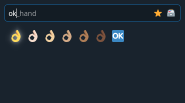
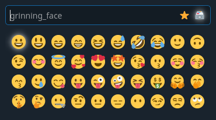
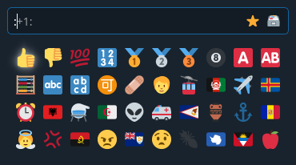

# x11-emoji-picker

A dialog / emoji picker inspired by the Windows 10 emoji picker written for Linux systems that use XServer.

Works for my use case most of the time. 😅

*Disclaimer: Donk code ahead FDM*

## Motivation 🤔

I switched from Windows 10 to Linux at work and missed filling my emails with emojis. ~~(the KDE version we use doesn't have the builtin emoji picker yet)~~ (turns out that the KDE emoji picker only copies emojis to clipboard anyway so yea fuck that)

## Screenshots 😮


*dialog with search result*


*dialog with full emoji list*


*dialog with github aliases*

## Installation 😉

Download the [install.sh](install.sh) and run it. It downloads and installs either a `.deb` (**Ubuntu**, **Debian**), a `.rpm` (**openSUSE**, **Fedora**) or the `.AppImage` (location: `/usr/bin/emoji-picker.AppImage`).

- Terminal: `wget -q https://raw.githubusercontent.com/GaZaTu/x11-emoji-picker/master/install.sh && sh install.sh`
- Installing nightly build: `sh install.sh -r tags/nightly-build`

Otherwise look at the following options:

**"I use Arch btw"**:
run `yay -S x11-emoji-picker-git`.

- repo: [https://aur.archlinux.org/packages/x11-emoji-picker-git](https://aur.archlinux.org/packages/x11-emoji-picker-git)
- yay: [https://github.com/Jguer/yay#installation](https://github.com/Jguer/yay#installation)
- manjaro: [https://wiki.manjaro.org/index.php/Arch_User_Repository](https://wiki.manjaro.org/index.php/Arch_User_Repository)

**Debian**:
Download a `-debian-*.deb` from [/releases](https://github.com/GaZaTu/x11-emoji-picker/releases) and install it.

- Terminal: `sudo apt install ./x11-emoji-picker-*.deb`

**Ubuntu**:
Download a `-ubuntu-*.deb` from [/releases](https://github.com/GaZaTu/x11-emoji-picker/releases) and install it.

- Terminal: `sudo apt install ./x11-emoji-picker-*.deb`

**openSUSE**:
Download a `-opensuse-*.rpm` from [/releases](https://github.com/GaZaTu/x11-emoji-picker/releases) and install it.

- Terminal: `sudo zypper install ./x11-emoji-picker-*.rpm`

**Fedora**:
Download a `-fedora-*.rpm` from [/releases](https://github.com/GaZaTu/x11-emoji-picker/releases) and install it.

- Terminal: `sudo dnf install ./x11-emoji-picker-*.rpm`

**Gentoo Ebuild**:
Third-party ebuilds provided in [https://gpo.zugaina.org/x11-plugins/x11-emoji-picker](https://gpo.zugaina.org/x11-plugins/x11-emoji-picker). Run `sudo eselect repository enable <ebuild provider>`, `sudo emerge --sync <ebuild provider>` and `sudo emerge x11-emoji-picker`.

**Other**:
Download the `.AppImage` from [/releases](https://github.com/GaZaTu/x11-emoji-picker/releases), [add executable permission](https://discourse.appimage.org/t/how-to-run-an-appimage/80) (`chmod +x x11-emoji-picker-*.AppImage`) and [run it](#appimage) (Read the usage instructions below).

*Note: There are [nightly releases](https://github.com/GaZaTu/x11-emoji-picker/releases/tag/nightly-build) aswell now which are rebuilt on every push to master*

## Building 🤓

This is a CMake project so you need `cmake`, `make` and some c++ compiler like `gcc`.

### Dependencies

- Qt5 (core, gui, widgets)
- ICU (uc)
- xdotool

**Arch**:
`sudo pacman -S qt5-base icu xdotool`

**Debian**:
`sudo apt install qtbase5-dev libicu-dev libxdo-dev`

**openSUSE**:
`sudo zypper install libqt5-qtbase-devel libicu-devel xdotool-devel`

### CMake

- `mkdir -p build`
- `cd build`
- `cmake -DCMAKE_BUILD_TYPE=Release ..`
- `make`

### Codegen

I committed the generated code so you won't have to run any scripts.

- script [.scripts/create-emoji-map.js](.scripts/create-emoji-map.js) to create [src/emojis.hpp](src/emojis.hpp) and [src/emojis.cpp](src/emojis.cpp)
- script [.scripts/create-emoji-aliases-ini.js](.scripts/create-emoji-aliases-ini.js) to create [src/aliases/github-emojis.ini](src/aliases/github-emojis.ini)

## Usage 🧐

First you should add the `emoji-picker` executable as a keybind (however you do that in your window manager); I use `meta+.` just like the windows keybind.

*Note: The executable path should be `/usr/bin/emoji-picker` if installed with `AUR`/`.deb`/`.rpm`/`make install`, which means it'll be on your `$PATH`.*

**KDE**:
[https://userbase.kde.org/Tutorials/hotkeys](https://userbase.kde.org/Tutorials/hotkeys)

**i3**:
[https://i3wm.org/docs/userguide.html#keybindings](https://i3wm.org/docs/userguide.html#keybindings)

The emoji picker will always write to the window that was active **before** starting the application. You have to restart it if you want to write to a different window.

After the emoji picker opened you can just begin typing to search for an emoji. Emojis that start with the text you entered will be shown below the text input. You can navigate these by using the **arrow keys**.

When you've selected your emoji you can press the **return key** to write it.

### Keybinds

- `Arrow keys` => navigate through shown emojis
- `Return` => write emoji to previously active window
- `Shift+Return` => write emoji to previously active window and close emoji picker
- `F1` => show recently used emojis (default view)
- `F2` => show list of all emojis (if you press this while searching, the view will jump to the currently selected emoji aswell)
- `F4` => close emoji picker and open settings file
- `F5` => toggle input method for current process (press [`F5` and then `Return`] a few times if emojis don't get written into the window; there are 4 different modes)
- `Tab` => toggle between `F1` and `F2`

### AppImage

*Disclaimer: Running the `.AppImage` directly can be slow AF (about 1 sec on my machine instead of 0.1 sec).*

I recommend running it (in the keybind) using the following command instead:

`NO_CLEANUP=true path/to/x11-emoji-picker-*.AppImage --appimage-extract-and-run`

*Note: This is much faster because it extracts itself to `/tmp` which makes subsequent runs have almost the same performance as if you ran the executable directly.*

### Settings

The settings file should be located at `$XDG_CONFIG_HOME/gazatu.xyz/emoji-picker.ini`.

- `[General] | activateWindowBeforeWritingByDefault` => `true` to activate windows by default before writing to them
- `[General] | aliasExactMatching` => `true` to only show aliased emojis when the search matches completely
- `[General] | customQssFilePath` => custom styling (colors and shit) for the emoji picker (refer to [src/main.qss](src/main.qss) for examples); useful if you don't like the dark theme
- `[General] | enableEmojiIncludesSearch` => `true` to enable sub-string search (for example: `joy` to find face_with_tears_of_joy); you need to enter 3 or more characters
- `[General] | gendersDisabled` => `true` if you only want to see gender neutral emojis (jobs or family or w/e)
- `[General] | hideInputMethod` => `true` if you don't want to see the input method
- `[General] | localeKey` => the emoji translation you want to use (en, de, fr, nl, da, it, pt, es, sv, pl, hr, cs, fi, el, hu) or empty if you want to use english with underscores
- `[General] | maxEmojiVersion` => set this to for example 12 to exclude emojis released after that or -1 to show all emojis
- `[General] | openAtMouseLocation` => `true` if you want to open the emoji picker dialog at the current mouse cursor
- `[General] | skinTonesDisabled` => `true` if you only want to see skin-tone neutral emojis (hands or jobs or family or w/e)
- `[General] | surroundAliasesWithColons` => `true` if you want emoji aliases to be in colons (:joy: for example)
- `[General] | swapEnterAndShiftEnter` => `true` if you want `Return` to close the window
- `[General] | useClipboardHackByDefault` => `true` to write emojis using `ctrl+v` by default (qt5 apps for example)
- `[General] | useSystemEmojiFont` => `true` if you want to use the system emoji font instead of the bundled twemoji images
- `[General] | useSystemEmojiFontWidthHeuristics` => `true` if you want to scale/hide unsupported emojis (may lead to false positives)
- `[General] | useSystemQtTheme` => `true` if you want to use the system qt theme (not recommended, usually only works with kde i think)
- `[General] | windowOpacity` => how seethrough the emoji picker is supposed to be (0 = invisible)
- `[activateWindowBeforeWritingExceptions]` => list of executables that should be an exception to the `[General] | activateWindowBeforeWritingByDefault` setting
- `[emojiAliasesIniFilePaths]` => list of custom emoji codes (refer to [src/aliases/github-emojis.ini](src/aliases/github-emojis.ini) for examples); points to the builtin list of github emojis by default ([https://github.com/ikatyang/emoji-cheat-sheet](https://github.com/ikatyang/emoji-cheat-sheet/blob/master/README.md)); also points to the builtin list of gitmoji emojis by default ([https://gitmoji.dev/](https://gitmoji.dev/))
- `[useClipboardHackExceptions]` => list of executables that should be an exception to the `[General] | useClipboardHackByDefault` setting

#### Notes

If emojis do not get written into your window: try adding that executable to the `[activateWindowBeforeWritingExceptions]` array or to the `[useClipboardHackExceptions]` array. (at runtime also possible using `F5`)

If the dialog is too smol for you: put `QT_SCALE_FACTOR=float` in front of the command. (example: `QT_SCALE_FACTOR=1.25 emoji-picker`)

Some things such as recently used emojis are written to `$XDG_CACHE_HOME/gazatu.xyz/emoji-picker/cache.ini`

If you enabled `useSystemEmojiFont` to display emojis inside the emoji picker: it's possible that your installed emoji font does not support all emojis (for example: at the time of writing noto-fonts-emoji does not support `heart_mending`) which will likely result in some emojis being either invisible or displayed as 2 separate emojis. To "fix" this behavior you can either set `maxEmojiVersion` to the version supported by your emoji font (for example: 12) or set `useSystemEmojiFontWidthHeuristics` to `true` (which is the default) to automatically figure it out.

#### Defaults

```ini
[General]
activateWindowBeforeWritingByDefault=false
aliasExactMatching=false
customQssFilePath=
enableEmojiIncludesSearch=true
gendersDisabled=false
hideInputMethod=false
localeKey=
maxEmojiVersion=-1
openAtMouseLocation=false
skinTonesDisabled=false
surroundAliasesWithColons=true
swapEnterAndShiftEnter=false
useClipboardHackByDefault=false
useSystemEmojiFont=false
useSystemEmojiFontWidthHeuristics=true
useSystemQtTheme=false
windowOpacity=0.9

[activateWindowBeforeWritingExceptions]
1\processName=code
2\processName=code-oss
3\processName=chrome
4\processName=chromium
5\processName=kate
6\processName=brave
size=5

[emojiAliasesIniFilePaths]
1\path=:/aliases/github-emojis.ini
2\path=:/aliases/gitmoji-emojis.ini
size=2

[useClipboardHackExceptions]
1\processName=chatterino
2\processName=kate
size=2
```

## Notes 📝

### Executable tested on:

- Manjaro KDE with KDE clipboard manager
- openSUSE KDE with KDE clipboard manager
- Debian i3 with parcellite
- Arch i3 with parcellite

### AppImage tested on:

- Manjaro KDE
- openSUSE KDE (built on this)
- Debian i3
- Arch i3

## Contributors 🤗

- [zneix](https://github.com/zneix) 😊👌

## License 😈

Code licensed under the [MIT](https://opensource.org/licenses/MIT) license: [LICENSE](LICENSE)

Graphics licensed by [Twitter](https://github.com/twitter) under *CC-BY 4.0* at [https://github.com/twitter/twemoji](https://github.com/twitter/twemoji/blob/master/LICENSE-GRAPHICS)

Emoji list and translations licensed by [Unicode](https://github.com/unicode-org) at [https://github.com/unicode-org/cldr](https://github.com/unicode-org/cldr/blob/master/unicode-license.txt)
